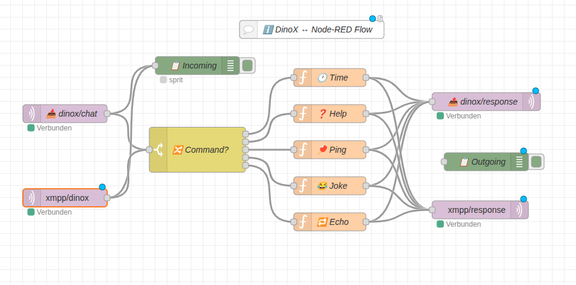
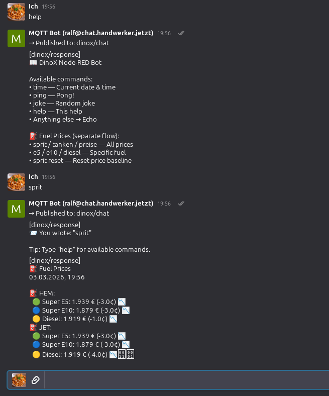
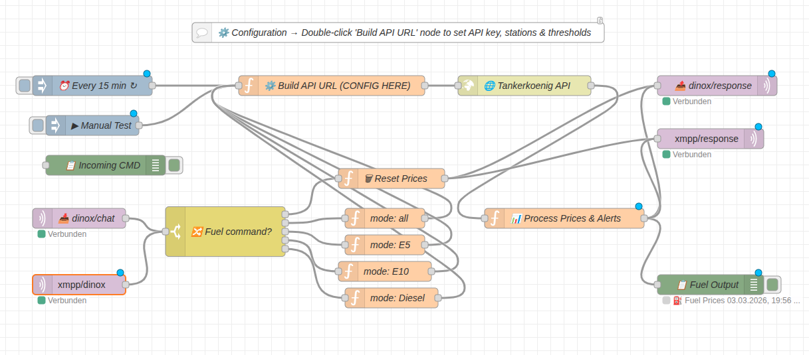

# Node-RED Flows für DinoX MQTT

> **Weitere Dokumentation:** [MQTT Plugin](../../docs/internal/MQTT_PLUGIN.md) · [MQTT UI Guide](../../docs/internal/MQTT_UI_GUIDE.md)

Diese Flows verbinden [Node-RED](https://nodered.org/) über MQTT mit dem DinoX MQTT-Bot.
Node-RED kommuniziert über ejabberds `mod_mqtt` auf Port 8883 (TLS) mit dem XMPP-Server.

## MQTT Topics

| Topic | Richtung | Beschreibung |
|-------|----------|-------------|
| `dinox/chat` | DinoX → Node-RED | Eingehende Chat-Nachrichten |
| `dinox/response` | Node-RED → DinoX | Antworten an den Chat |

---

## ejabberd mod_mqtt Konfiguration

In der `ejabberd.yml` muss ein MQTT-Listener konfiguriert sein:

```yaml
listen:
  -
    port: 8883
    ip: "::"
    module: mod_mqtt
    backlog: 1000
    tls: true
    certfile: /path/to/fullchain.pem
    keyfile: /path/to/privkey.pem

modules:
  mod_mqtt: {}
```

Node-RED MQTT-Broker: `chat.handwerker.jetzt:8883`, Benutzer = volle JID (z.B. `dinox@chat.handwerker.jetzt`), TLS aktiviert.

---

## Flow 1: DinoX Bot

Bidirektionaler Bot — empfängt Nachrichten auf `dinox/chat`, antwortet auf `dinox/response`.

| Befehl | Funktion |
|--------|----------|
| `help` | Hilfe anzeigen |
| `time` | Aktuelle Uhrzeit |
| `ping` | Pong-Antwort |
| `joke` | Zufallswitz |
| *alles andere* | Echo |





<details>
<summary><strong>Flow-JSON zum Importieren (klick zum Aufklappen)</strong></summary>

```json
[
    {
        "id": "dinox_tab",
        "type": "tab",
        "label": "DinoX MQTT Bot",
        "disabled": false,
        "info": "Bidirectional communication with DinoX via MQTT.\n\nReceives messages from dinox/chat and replies on dinox/response."
    },
    {
        "id": "mqtt_in_dinox",
        "type": "mqtt in",
        "z": "dinox_tab",
        "name": "📥 dinox/chat",
        "topic": "dinox/chat",
        "qos": "1",
        "datatype": "utf8",
        "broker": "",
        "nl": false,
        "rap": true,
        "rh": 0,
        "inputs": 0,
        "x": 130,
        "y": 200,
        "wires": [
            ["debug_in", "cmd_switch"]
        ]
    },
    {
        "id": "debug_in",
        "type": "debug",
        "z": "dinox_tab",
        "name": "📋 Incoming",
        "active": true,
        "tosidebar": true,
        "console": false,
        "tostatus": true,
        "complete": "payload",
        "targetType": "msg",
        "statusVal": "payload",
        "statusType": "auto",
        "x": 350,
        "y": 120,
        "wires": []
    },
    {
        "id": "cmd_switch",
        "type": "switch",
        "z": "dinox_tab",
        "name": "🔀 Command?",
        "property": "payload",
        "propertyType": "msg",
        "rules": [
            { "t": "cont", "v": "time", "vt": "str" },
            { "t": "cont", "v": "help", "vt": "str" },
            { "t": "cont", "v": "ping", "vt": "str" },
            { "t": "cont", "v": "joke", "vt": "str" },
            { "t": "else" }
        ],
        "checkall": "false",
        "repair": false,
        "outputs": 5,
        "x": 350,
        "y": 260,
        "wires": [
            ["cmd_time"],
            ["cmd_help"],
            ["cmd_ping"],
            ["cmd_joke"],
            ["cmd_echo"]
        ]
    },
    {
        "id": "cmd_time",
        "type": "function",
        "z": "dinox_tab",
        "name": "🕐 Time",
        "func": "const now = new Date();\nconst opts = { \n    weekday: 'long', year: 'numeric', \n    month: 'long', day: 'numeric',\n    hour: '2-digit', minute: '2-digit', second: '2-digit',\n    timeZone: 'Europe/Berlin'\n};\nmsg.payload = '🕐 ' + now.toLocaleDateString('en-US', opts) + ', ' + now.toLocaleTimeString('en-US', opts);\nreturn msg;",
        "outputs": 1,
        "timeout": "",
        "noerr": 0,
        "initialize": "",
        "finalize": "",
        "libs": [],
        "x": 570,
        "y": 140,
        "wires": [
            ["mqtt_out_dinox"]
        ]
    },
    {
        "id": "cmd_help",
        "type": "function",
        "z": "dinox_tab",
        "name": "❓ Help",
        "func": "msg.payload = '📖 DinoX Node-RED Bot\\n\\n' +\n    'Available commands:\\n' +\n    '• time — Current date & time\\n' +\n    '• ping — Pong!\\n' +\n    '• joke — Random joke\\n' +\n    '• help — This help\\n' +\n    '• Anything else → Echo\\n\\n' +\n    '⛽ Fuel Prices (separate flow):\\n' +\n    '• sprit / tanken / preise — All prices\\n' +\n    '• e5 / e10 / diesel — Specific fuel\\n' +\n    '• sprit reset — Reset price baseline';\nreturn msg;",
        "outputs": 1,
        "timeout": "",
        "noerr": 0,
        "initialize": "",
        "finalize": "",
        "libs": [],
        "x": 570,
        "y": 200,
        "wires": [
            ["mqtt_out_dinox"]
        ]
    },
    {
        "id": "cmd_ping",
        "type": "function",
        "z": "dinox_tab",
        "name": "🏓 Ping",
        "func": "const start = Date.now();\nmsg.payload = '🏓 Pong! (Node-RED antwortet in ' + (Date.now() - start) + 'ms)';\nreturn msg;",
        "outputs": 1,
        "timeout": "",
        "noerr": 0,
        "initialize": "",
        "finalize": "",
        "libs": [],
        "x": 570,
        "y": 260,
        "wires": [
            ["mqtt_out_dinox"]
        ]
    },
    {
        "id": "cmd_joke",
        "type": "function",
        "z": "dinox_tab",
        "name": "😂 Joke",
        "func": "const jokes = [\n    `😂 Why do ghosts make bad liars? Because you can see right through them.`,\n    `😂 What does an IT guy say when he's cold? \"Hold on, let me open a few Windows.\"`,\n    `😂 What do you call a boomerang that doesn't come back? A stick.`,\n    `😂 Why do programmers prefer dark mode? Because light attracts bugs.`,\n    `😂 Two magnets walk into a bar. One says: What should I wear today?`,\n    `😂 Why do programmers drink so much coffee? Because Java doesn't run without it.`,\n    `😂 What's on a mathematician's tombstone? He didn't count on that.`,\n];\nconst idx = Math.floor(Math.random() * jokes.length);\nmsg.payload = jokes[idx];\nreturn msg;",
        "outputs": 1,
        "timeout": "",
        "noerr": 0,
        "initialize": "",
        "finalize": "",
        "libs": [],
        "x": 570,
        "y": 320,
        "wires": [
            ["mqtt_out_dinox"]
        ]
    },
    {
        "id": "cmd_echo",
        "type": "function",
        "z": "dinox_tab",
        "name": "🔁 Echo",
        "func": "msg.payload = '📨 You wrote: \"' + msg.payload + '\"\\n\\nTip: Type \"help\" for available commands.';\nreturn msg;",
        "outputs": 1,
        "timeout": "",
        "noerr": 0,
        "initialize": "",
        "finalize": "",
        "libs": [],
        "x": 570,
        "y": 380,
        "wires": [
            ["mqtt_out_dinox"]
        ]
    },
    {
        "id": "mqtt_out_dinox",
        "type": "mqtt out",
        "z": "dinox_tab",
        "name": "📤 dinox/response",
        "topic": "dinox/response",
        "qos": "1",
        "retain": "",
        "respTopic": "",
        "contentType": "",
        "userProps": "",
        "correl": "",
        "expiry": "",
        "broker": "",
        "x": 830,
        "y": 260,
        "wires": []
    },
    {
        "id": "debug_out",
        "type": "debug",
        "z": "dinox_tab",
        "name": "📋 Outgoing",
        "active": true,
        "tosidebar": true,
        "console": false,
        "tostatus": true,
        "complete": "payload",
        "targetType": "msg",
        "statusVal": "payload",
        "statusType": "auto",
        "x": 830,
        "y": 360,
        "wires": []
    },
    {
        "id": "comment_info",
        "type": "comment",
        "z": "dinox_tab",
        "name": "ℹ️ DinoX ↔ Node-RED Flow",
        "info": "## Setup\n\n1. Double-click the MQTT nodes (📥 and 📤)\n2. Configure broker (localhost:1883 or your MQTT broker)\n3. Click Deploy\n4. In DinoX bot chat type: help, time, ping, joke\n\n## Topics\n- dinox/chat → Node-RED receives\n- dinox/response → DinoX receives\n\n## Fuel Prices\nImport the 'tankerkoenig_dinox.json' flow for fuel price monitoring.\nCommands: sprit, e5, e10, diesel, sprit reset",
        "x": 170,
        "y": 60,
        "wires": []
    }
]
```

</details>

---

## Flow 2: Tankerkoenig Spritpreise

Automatische Spritpreis-Überwachung mit der [Tankerkönig API](https://creativecommons.tankerkoenig.de/).
Prüft alle 15 Minuten die Preise und sendet Alerts bei Preisänderungen über den DinoX-Chat.

| Befehl | Funktion |
|--------|----------|
| `sprit` / `tanken` / `preise` | Alle Preise anzeigen |
| `e5` | Nur Super E5 |
| `e10` | Nur Super E10 |
| `diesel` | Nur Diesel |
| `sprit reset` | Gespeicherte Preise zurücksetzen |

**Auto-Alerts:** Alle 15 Min werden die Preise geprüft. Ändert sich ein Preis um mehr als
den Schwellenwert (Standard: 2 Cent), wird automatisch eine Nachricht gesendet.

**Einrichtung:** Doppelklick auf den gelben Node "Build API URL" →
API-Key, Tankstellen-UUIDs und Schwellenwerte eintragen.



<details>
<summary><strong>Flow-JSON zum Importieren (klick zum Aufklappen)</strong></summary>

```json
[
    {
        "id": "fuel_tab",
        "type": "tab",
        "label": "⛽ Fuel Prices + DinoX",
        "disabled": false,
        "info": "Integrated fuel price monitoring with DinoX MQTT bot.\n\n• Auto-checks prices every 15 minutes\n• Sends alerts when prices change beyond threshold\n• Manual queries: sprit, e5, e10, diesel, tanken, preise\n• Reset stored prices: sprit reset"
    },
    {
        "id": "fuel_comment",
        "type": "comment",
        "z": "fuel_tab",
        "name": "⚙️ Configuration → Double-click 'Build API URL' node to set API key, stations & thresholds",
        "info": "## Setup\n\n1. Double-click the **Build API URL** node (yellow, center)\n2. Set your Tankerkoenig API key\n3. Add/remove station UUIDs\n4. Set price change thresholds for auto-alerts\n5. Double-click MQTT nodes and configure your broker\n6. Click Deploy\n\n## Commands (type in DinoX chat)\n- **sprit** / **tanken** / **preise** — All prices\n- **e5** — Super E5 only\n- **e10** — Super E10 only\n- **diesel** — Diesel only\n- **sprit reset** — Reset stored prices (new baseline)\n\n## Auto-Alerts\nEvery 15 minutes prices are checked.\nIf a price changes by more than the configured threshold,\nan alert is sent to DinoX automatically.\n\n## Topics\n- dinox/chat → receives commands\n- dinox/response → sends prices & alerts",
        "x": 430,
        "y": 40,
        "wires": []
    },
    {
        "id": "fuel_timer",
        "type": "inject",
        "z": "fuel_tab",
        "name": "⏰ Every 15 min",
        "props": [
            { "p": "payload" },
            { "p": "mode", "v": "auto", "vt": "str" }
        ],
        "repeat": "900",
        "crontab": "",
        "once": false,
        "onceDelay": "10",
        "topic": "",
        "payload": "auto_check",
        "payloadType": "str",
        "x": 150,
        "y": 160,
        "wires": [
            ["fuel_config"]
        ]
    },
    {
        "id": "fuel_manual_trigger",
        "type": "inject",
        "z": "fuel_tab",
        "name": "▶ Manual Test",
        "props": [
            { "p": "payload" },
            { "p": "mode", "v": "manual", "vt": "str" },
            { "p": "fuelFilter", "v": "all", "vt": "str" }
        ],
        "repeat": "",
        "crontab": "",
        "once": false,
        "onceDelay": 0.1,
        "topic": "",
        "payload": "sprit",
        "payloadType": "str",
        "x": 150,
        "y": 220,
        "wires": [
            ["fuel_config"]
        ]
    },
    {
        "id": "fuel_mqtt_in",
        "type": "mqtt in",
        "z": "fuel_tab",
        "name": "📥 dinox/chat",
        "topic": "dinox/chat",
        "qos": "1",
        "datatype": "utf8",
        "broker": "",
        "nl": false,
        "rap": true,
        "rh": 0,
        "inputs": 0,
        "x": 150,
        "y": 360,
        "wires": [
            ["fuel_cmd_switch"]
        ]
    },
    {
        "id": "fuel_cmd_switch",
        "type": "switch",
        "z": "fuel_tab",
        "name": "🔀 Fuel command?",
        "property": "payload",
        "propertyType": "msg",
        "rules": [
            { "t": "regex", "v": "sprit.*reset|reset.*sprit|preis.*reset|reset.*preis", "vt": "str", "case": true },
            { "t": "regex", "v": "sprit|fuel|tanken|preise|prices|benzin|tankstelle", "vt": "str", "case": true },
            { "t": "regex", "v": "\\be5\\b|super e5|super5", "vt": "str", "case": true },
            { "t": "regex", "v": "\\be10\\b|super e10|super10", "vt": "str", "case": true },
            { "t": "regex", "v": "diesel", "vt": "str", "case": true }
        ],
        "checkall": "false",
        "repair": false,
        "outputs": 5,
        "x": 380,
        "y": 360,
        "wires": [
            ["fuel_reset"],
            ["fuel_set_manual_all"],
            ["fuel_set_manual_e5"],
            ["fuel_set_manual_e10"],
            ["fuel_set_manual_diesel"]
        ]
    },
    {
        "id": "fuel_reset",
        "type": "function",
        "z": "fuel_tab",
        "name": "🗑 Reset Prices",
        "func": "flow.set('lastPrices', {});\nmsg.payload = '🗑 Stored fuel prices have been reset.\\nNext auto-check will establish a new baseline.';\nreturn msg;",
        "outputs": 1,
        "timeout": "",
        "noerr": 0,
        "initialize": "",
        "finalize": "",
        "libs": [],
        "x": 620,
        "y": 300,
        "wires": [
            ["fuel_mqtt_out"]
        ]
    },
    {
        "id": "fuel_set_manual_all",
        "type": "function",
        "z": "fuel_tab",
        "name": "mode: all",
        "func": "msg.mode = 'manual';\nmsg.fuelFilter = 'all';\nreturn msg;",
        "outputs": 1,
        "timeout": "",
        "noerr": 0,
        "initialize": "",
        "finalize": "",
        "libs": [],
        "x": 610,
        "y": 360,
        "wires": [
            ["fuel_config"]
        ]
    },
    {
        "id": "fuel_set_manual_e5",
        "type": "function",
        "z": "fuel_tab",
        "name": "mode: E5",
        "func": "msg.mode = 'manual';\nmsg.fuelFilter = 'e5';\nreturn msg;",
        "outputs": 1,
        "timeout": "",
        "noerr": 0,
        "initialize": "",
        "finalize": "",
        "libs": [],
        "x": 610,
        "y": 400,
        "wires": [
            ["fuel_config"]
        ]
    },
    {
        "id": "fuel_set_manual_e10",
        "type": "function",
        "z": "fuel_tab",
        "name": "mode: E10",
        "func": "msg.mode = 'manual';\nmsg.fuelFilter = 'e10';\nreturn msg;",
        "outputs": 1,
        "timeout": "",
        "noerr": 0,
        "initialize": "",
        "finalize": "",
        "libs": [],
        "x": 610,
        "y": 440,
        "wires": [
            ["fuel_config"]
        ]
    },
    {
        "id": "fuel_set_manual_diesel",
        "type": "function",
        "z": "fuel_tab",
        "name": "mode: Diesel",
        "func": "msg.mode = 'manual';\nmsg.fuelFilter = 'diesel';\nreturn msg;",
        "outputs": 1,
        "timeout": "",
        "noerr": 0,
        "initialize": "",
        "finalize": "",
        "libs": [],
        "x": 620,
        "y": 480,
        "wires": [
            ["fuel_config"]
        ]
    },
    {
        "id": "fuel_config",
        "type": "function",
        "z": "fuel_tab",
        "name": "⚙️ Build API URL (CONFIG HERE)",
        "func": "// ════════════════════════════════════════════════\n// ⚙️  CONFIGURATION — Edit these values!\n// ════════════════════════════════════════════════\n\n// 1) Your Tankerkoenig API key\n//    Get one free at: https://creativecommons.tankerkoenig.de\nconst API_KEY = \"YOUR_API_KEY_HERE\";\n\n// 2) Gas stations: Name → Tankerkoenig UUID\n//    Find station UUIDs at: https://creativecommons.tankerkoenig.de/TanksijsonApiDetaile\nconst STATIONS = {\n    \"HEM\":  \"e1a15081-256b-9107-e040-0b0a3dfe563c\",\n    \"JET\":  \"51d4b716-a095-1aa0-e100-80009459e03a\"\n};\n\n// 3) Price change thresholds for auto-alerts (in EUR)\n//    Example: 0.02 = alert when price changes by ≥ 2 cents\n//    Set to 0 to alert on ANY change\nconst THRESHOLDS = {\n    e5:     0.02,\n    e10:    0.02,\n    diesel: 0.02\n};\n\n// ════════════════════════════════════════════════\n// ⚠️  Don't edit below this line\n// ════════════════════════════════════════════════\n\nmsg.stations = STATIONS;\nmsg.thresholds = THRESHOLDS;\n\nconst ids = Object.values(STATIONS).join(',');\nmsg.url = `https://creativecommons.tankerkoenig.de/json/prices.php?ids=${ids}&apikey=${API_KEY}`;\n\nreturn msg;",
        "outputs": 1,
        "timeout": "",
        "noerr": 0,
        "initialize": "",
        "finalize": "",
        "libs": [],
        "x": 530,
        "y": 160,
        "wires": [
            ["fuel_http"]
        ]
    },
    {
        "id": "fuel_http",
        "type": "http request",
        "z": "fuel_tab",
        "name": "🌐 Tankerkoenig API",
        "method": "GET",
        "ret": "obj",
        "paytoqs": "ignore",
        "url": "",
        "tls": "",
        "persist": false,
        "proxy": "",
        "insecureHTTPParser": false,
        "authType": "",
        "senderr": false,
        "headers": [],
        "x": 780,
        "y": 160,
        "wires": [
            ["fuel_process"]
        ]
    },
    {
        "id": "fuel_process",
        "type": "function",
        "z": "fuel_tab",
        "name": "📊 Process Prices & Alerts",
        "func": "const data = msg.payload;\nconst stations = msg.stations;\nconst thresholds = msg.thresholds;\nconst mode = msg.mode || 'manual';\nconst fuelFilter = msg.fuelFilter || 'all';\n\n// Check API response\nif (!data || !data.ok) {\n    msg.payload = '⚠️ Error fetching fuel prices: ' + \n        (data && data.message ? data.message : 'No response from API');\n    return msg;\n}\n\nconst prices = data.prices;\nconst fuelTypes = ['e5', 'e10', 'diesel'];\nconst fuelLabels = { e5: 'Super E5', e10: 'Super E10', diesel: 'Diesel' };\nconst fuelEmoji = { e5: '🟢', e10: '🔵', diesel: '🟡' };\n\n// Get stored prices from flow context\nconst stored = flow.get('lastPrices') || {};\n\nlet alerts = [];\nlet lines = [];\n\n// Timestamp\nconst now = new Date().toLocaleString('de-DE', {\n    timeZone: 'Europe/Berlin',\n    hour: '2-digit', minute: '2-digit',\n    day: '2-digit', month: '2-digit', year: 'numeric'\n});\n\nfor (const [name, uuid] of Object.entries(stations)) {\n    const sp = prices[uuid];\n    \n    if (!sp || sp.status !== 'open') {\n        lines.push(`❌ ${name}: Closed`);\n        continue;\n    }\n    \n    const stKey = name;\n    if (!stored[stKey]) stored[stKey] = {};\n    \n    let stationLines = [];\n    \n    for (const fuel of fuelTypes) {\n        if (fuelFilter !== 'all' && fuel !== fuelFilter) continue;\n        \n        const price = sp[fuel];\n        if (price === null || price === undefined || price === false) continue;\n        \n        const oldPrice = stored[stKey][fuel];\n        const hasOld = (oldPrice !== undefined && oldPrice !== null);\n        const delta = hasOld ? (price - oldPrice) : 0;\n        \n        let arrow = '';\n        let deltaStr = '';\n        if (hasOld && delta !== 0) {\n            arrow = delta > 0 ? ' ▲' : ' ▼';\n            const sign = delta > 0 ? '+' : '';\n            deltaStr = ` (${sign}${(delta * 100).toFixed(1)}¢)`;\n        }\n        \n        stationLines.push(\n            `  ${fuelEmoji[fuel]} ${fuelLabels[fuel]}: ${price.toFixed(3)} €${deltaStr}${arrow}`\n        );\n        \n        // Check threshold for auto-alerts\n        if (mode === 'auto' && hasOld) {\n            const threshold = thresholds[fuel] || 0.02;\n            if (Math.abs(delta) >= threshold) {\n                const sign = delta > 0 ? '+' : '';\n                const icon = delta > 0 ? '▲' : '▼';\n                alerts.push(\n                    `${icon} ${name} ${fuelLabels[fuel]}: ` +\n                    `${oldPrice.toFixed(3)} → ${price.toFixed(3)} € ` +\n                    `(${sign}${(delta * 100).toFixed(1)}¢)`\n                );\n            }\n        }\n        \n        // Store new price\n        stored[stKey][fuel] = price;\n    }\n    \n    if (stationLines.length > 0) {\n        lines.push(`⛽ ${name}:`);\n        lines = lines.concat(stationLines);\n    }\n}\n\n// Save prices to flow context\nflow.set('lastPrices', stored);\n\nif (mode === 'auto') {\n    // Only send if there are threshold alerts\n    if (alerts.length === 0) return null;\n    msg.payload = `🔔 Fuel Price Alert\\n${now}\\n\\n${alerts.join('\\n')}`;\n} else {\n    // Manual query: always send\n    const filterNote = fuelFilter !== 'all' \n        ? ` (${fuelLabels[fuelFilter]})` \n        : '';\n    msg.payload = `⛽ Fuel Prices${filterNote}\\n${now}\\n\\n${lines.join('\\n')}`;\n}\n\nreturn msg;",
        "outputs": 1,
        "timeout": "",
        "noerr": 0,
        "initialize": "",
        "finalize": "",
        "libs": [],
        "x": 1010,
        "y": 160,
        "wires": [
            ["fuel_mqtt_out", "fuel_debug"]
        ]
    },
    {
        "id": "fuel_mqtt_out",
        "type": "mqtt out",
        "z": "fuel_tab",
        "name": "📤 dinox/response",
        "topic": "dinox/response",
        "qos": "1",
        "retain": "",
        "respTopic": "",
        "contentType": "",
        "userProps": "",
        "correl": "",
        "expiry": "",
        "broker": "",
        "x": 1250,
        "y": 160,
        "wires": []
    },
    {
        "id": "fuel_debug",
        "type": "debug",
        "z": "fuel_tab",
        "name": "📋 Fuel Output",
        "active": true,
        "tosidebar": true,
        "console": false,
        "tostatus": true,
        "complete": "payload",
        "targetType": "msg",
        "statusVal": "payload",
        "statusType": "auto",
        "x": 1250,
        "y": 240,
        "wires": []
    },
    {
        "id": "fuel_debug_in",
        "type": "debug",
        "z": "fuel_tab",
        "name": "📋 Incoming CMD",
        "active": true,
        "tosidebar": true,
        "console": false,
        "tostatus": true,
        "complete": "payload",
        "targetType": "msg",
        "statusVal": "payload",
        "statusType": "auto",
        "x": 380,
        "y": 300,
        "wires": []
    }
]
```

</details>

---

## Import in Node-RED

1. Node-RED öffnen → Menü (☰) → **Import**
2. JSON-Block oben kopieren oder die `.json`-Dateien direkt importieren
3. MQTT-Broker-Nodes konfigurieren (Server, Port 8883, TLS, Zugangsdaten)
4. **Deploy** klicken
