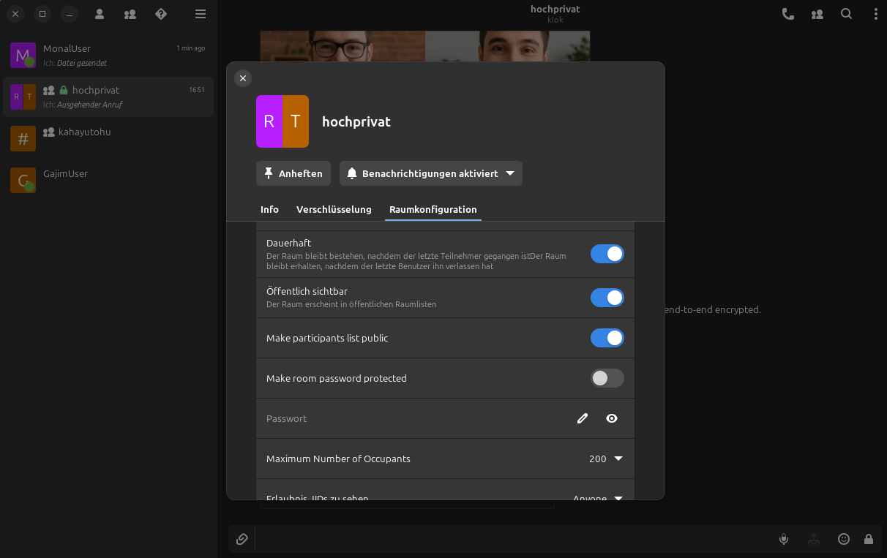
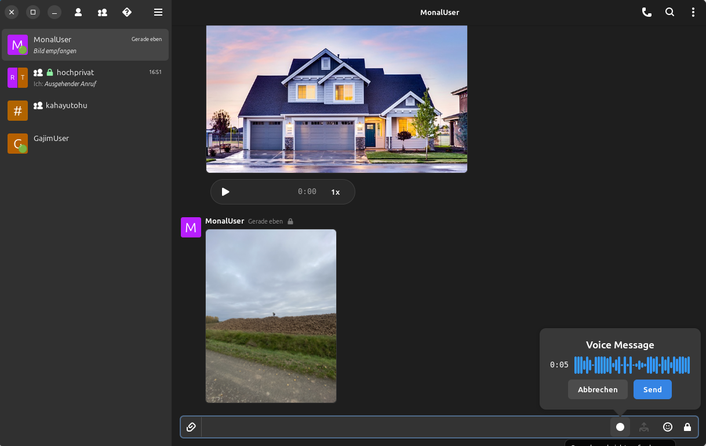
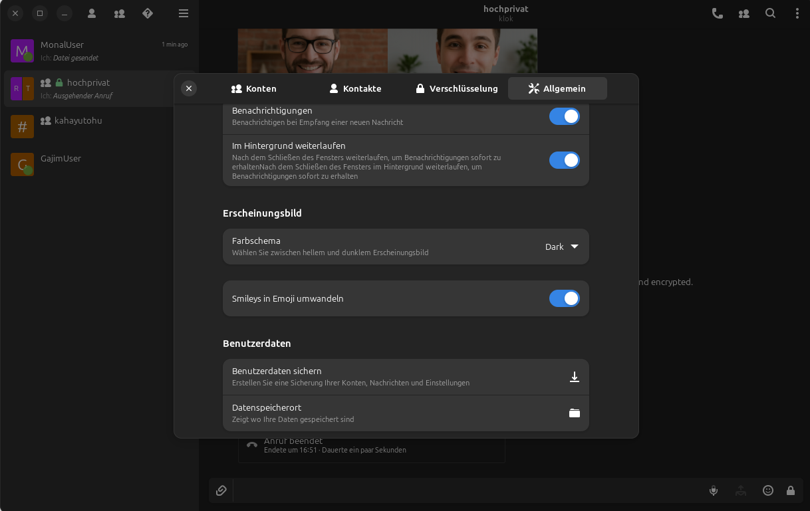

<div align="center">


# DinoX

[](LICENSE)
[](https://www.gtk.org/)
[](https://github.com/rallep71/dinox/releases)

**Modern XMPP Messenger for Linux**

Featuring MUJI group video calls, voice messages, OMEMO encryption and 45 languages

[Website](https://dinox.handwerker.jetzt) • [Download](#installation) • [Features](#key-features) • [XEP Support](#xep-support) • [Contributing](CONTRIBUTING.md)

</div>

---

## What is DinoX?

DinoX is a modern XMPP (Jabber) messaging client for Linux built with **GTK4** and **libadwaita**. 

DinoX features System Tray support, MUJI group video calls, voice messages, message retraction, advanced MUC moderation and more.

## Key Features

| Feature | Description |
|---------|-------------|
| **OMEMO Encryption** | End-to-end encryption for all messages and files |
| **MUJI Group Calls** | Multi-party audio/video conferences (mesh-based) |
| **1:1 Voice & Video** | High-quality Jingle calls with ICE/STUN/TURN |
| **Voice Messages** | Record and send audio messages (AAC format) |
| **Group Chats (MUC)** | Full support with moderation, roles, private rooms |
| **System Tray** | Background mode with StatusNotifierItem |
| **Message Retraction** | Delete messages for everyone (XEP-0424) |
| **Emoji Reactions** | React to messages (XEP-0444) |
| **Message Replies** | Quote and reply to messages (XEP-0461) |
| **MUC Moderation** | Kick, ban (timed), manage roles (XEP-0425) |
| **Backup & Restore** | Full data backup with optional GPG encryption (AES-256) |
| **Database Maintenance** | Clean orphaned records, optimize storage |
| **45 Languages** | 100% translated |
| **Dark Mode** | System theme or manual toggle |

## Installation

### Flatpak

Download from [GitHub Releases](https://github.com/rallep71/dinox/releases/latest)

```bash
flatpak install --user DinoX.flatpak
flatpak run im.github.rallep71.DinoX
```

### AppImage

Download from [GitHub Releases](https://github.com/rallep71/dinox/releases/latest)

```bash
chmod +x DinoX-*.AppImage
./DinoX-*.AppImage
```

### Build from Source

```bash
git clone https://github.com/rallep71/dinox.git
cd dinox
meson setup build
ninja -C build
./build/main/dinox
```

**Dependencies (Debian/Ubuntu):**
```bash
sudo apt install build-essential meson ninja-build valac \
  libgtk-4-dev libadwaita-1-dev libglib2.0-dev libgee-0.8-dev \
  libsqlite3-dev libicu-dev libdbusmenu-glib-dev libgcrypt20-dev \
  libgpgme-dev libqrencode-dev libsoup-3.0-dev libgstreamer1.0-dev \
  libgstreamer-plugins-base1.0-dev libwebrtc-audio-processing-dev \
  libnice-dev libsrtp2-dev
```

## XEP Support

DinoX implements **67 XMPP Extension Protocols**. Here are the key ones with full UI support:

### Messaging
| XEP | Name | Status |
|-----|------|--------|
| XEP-0085 | Chat State Notifications | Full |
| XEP-0184 | Message Delivery Receipts | Full |
| XEP-0308 | Last Message Correction | Full |
| XEP-0313 | Message Archive Management | Full |
| XEP-0333 | Chat Markers | Full |
| XEP-0424 | Message Retraction | Full |
| XEP-0444 | Message Reactions | Full |
| XEP-0461 | Message Replies | Full |

### Security
| XEP | Name | Status |
|-----|------|--------|
| XEP-0384 | OMEMO Encryption | Full |
| XEP-0373 | OpenPGP for XMPP | Full |
| XEP-0454 | OMEMO Media Sharing | Full |

### Voice & Video
| XEP | Name | Status |
|-----|------|--------|
| XEP-0166 | Jingle | Full |
| XEP-0167 | Jingle RTP | Full |
| XEP-0272 | MUJI (Group Calls) | Full |
| XEP-0176 | Jingle ICE | Full |
| XEP-0320 | Jingle DTLS | Full |

### Multi-User Chat
| XEP | Name | Status |
|-----|------|--------|
| XEP-0045 | Multi-User Chat | Full |
| XEP-0249 | Direct MUC Invitations | Full |
| XEP-0421 | Anonymous Unique IDs | Full |
| XEP-0425 | Message Moderation | Full |

### File Transfer
| XEP | Name | Status |
|-----|------|--------|
| XEP-0363 | HTTP File Upload | Full |
| XEP-0234 | Jingle File Transfer | Full |
| XEP-0447 | Stateless File Sharing | Full |

### Core
| XEP | Name | Status |
|-----|------|--------|
| XEP-0030 | Service Discovery | Full |
| XEP-0115 | Entity Capabilities | Full |
| XEP-0198 | Stream Management | Full |
| XEP-0280 | Message Carbons | Full |
| XEP-0352 | Client State Indication | Full |
| XEP-0368 | SRV for XMPP over TLS | Full |

## Screenshots

<p align="center">
  
  
</p>
<p align="center">
  
  
</p>

## Resources

| Resource | Link |
|----------|------|
| **Website** | [dinox.handwerker.jetzt](https://dinox.handwerker.jetzt) |
| **Releases** | [GitHub Releases](https://github.com/rallep71/dinox/releases) |
| **Issues** | [Bug Tracker](https://github.com/rallep71/dinox/issues) |
| **XMPP Chat** | [dinox@chat.handwerker.jetzt](xmpp:dinox@chat.handwerker.jetzt?join) |
| **Email** | dinox@handwerker.jetzt |
| **Ko-fi** | [ko-fi.com/rallep](https://ko-fi.com/rallep) |

## Contributing

See [CONTRIBUTING.md](CONTRIBUTING.md) for how to contribute.

## Debug Mode

See [DEBUG.md](DEBUG.md) for debugging instructions.

## License

**GPL-3.0** - See [LICENSE](LICENSE) for details.

---

<div align="center">

**Made for the XMPP community**

[Star on GitHub](https://github.com/rallep71/dinox) | [Report Issues](https://github.com/rallep71/dinox/issues) | [Support](https://ko-fi.com/rallep)

</div>
