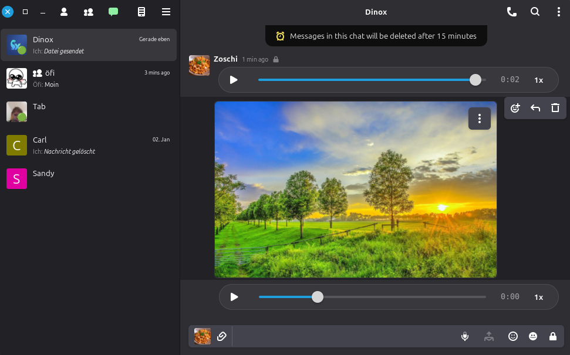

<div align="center">


# DinoX

[](LICENSE)
[](https://www.gtk.org/)
[](https://github.com/rallep71/dinox/releases)
[](https://hosted.weblate.org/engage/dinox/)

**The Most Secure XMPP Messenger for Linux & Windows**

Built for ultimate privacy with integrated Tor & Obfs4proxy, full local database encryption, and decentralized MUJI Group Video Calls

[Website](https://dinox.handwerker.jetzt) • [Download](#installation) • [Features](#key-features) • [XEP Support](#xep-support) • [Build](BUILD.md) • [Debug](DEBUG.md) • [Changelog](CHANGELOG.md) • [Development Plan](DEVELOPMENT_PLAN.md) • [Contributing](CONTRIBUTING.md)

</div>

---

## What is DinoX?

DinoX is a secure XMPP messenger for Linux & Windows with built-in Tor & Obfs4proxy (Zero-Config Privacy). Features OMEMO encryption, decentralized Group Video Calls, hardware acceleration, and full database encryption in a modern GTK4/libadwaita interface.

DinoX features System Tray support, MUJI group video calls, voice messages, message retraction, advanced MUC moderation and more.

## Key Features

| Feature | Description |
|---------|-------------|
| **Encrypted File Upload** | AES-GCM URI Scheme & XEP-0448 support for secure file sharing |
| **Full Local Encryption** | All local files (avatars, stickers, transfers) are encrypted at rest (AES-256-GCM) |
| **Secure Deletion** | Global history deletion (both sides) with smart throttling & zero-trace cache cleanup |
| **OMEMO Encryption** | End-to-end encryption for messages and files (OMEMO Legacy + OMEMO 2) |
| **OpenPGP Encryption** | XEP-0027 (Legacy) + XEP-0373/0374 with key management, generation, deletion & revocation |
| **Encrypted Local Database** | Local data is stored in an encrypted SQLCipher database (password required at startup) |
| **Change Database Password** | Change the local database password via Preferences (SQLCipher rekey) |
| **Panic Wipe** | Quickly wipe local DinoX data (`Ctrl+Shift+Alt+P`) and exit (also triggered after 3 failed unlock attempts) |
| **OpenPGP Keyring Isolation** | Uses an app-scoped `GNUPGHOME` so Panic Wipe removes OpenPGP material |
| **Disappearing Messages** | Auto-delete messages after 15min, 30min, 1h, 24h, 7d or 30d |
| **MUJI Group Calls** | Multi-party audio/video conferences (mesh-based) |
| **1:1 Voice & Video** | Crystal clear calls with Echo Cancellation, Noise Suppression, AGC & Transient Suppression |
| **Voice Messages** | Record and send audio messages (AAC format) |
| **Inline Video Player** | Play videos directly in chat (no external player) |
| **Group Chats (MUC)** | Full support with moderation, roles, private rooms |
| **Out-of-the-Box Tor** | Integrated Tor & Obfs4proxy (ZERO-Config) for instant privacy & anonymity |
| **System Tray** | Background mode with StatusNotifierItem |
| **Message Retraction** | Delete messages for everyone (XEP-0424) |
| **Emoji Reactions** | React to messages (XEP-0444) |
| **Stickers** | Send & receive sticker packs (XEP-0449) |
| **Message Replies** | Quote and reply to messages (XEP-0461) |
| **MUC Moderation** | Kick, ban (timed), manage roles (XEP-0425) |
| **TLS Certificate Pinning** | Trust self-signed certs for self-hosted servers |
| **TLS Certificate Info** | View TLS certificate details (issuer, validity, fingerprint) in account settings |
| **Backup & Restore** | Full data backup with optional GPG encryption (AES-256) |
| **Database Maintenance** | Clean orphaned records, optimize storage |
| **PGP Key Management** | Generate, select, delete, revoke OpenPGP keys in-app. Automatic key exchange via PEP |
| **47 Languages** | ~85% translated — [help translate on Weblate](https://hosted.weblate.org/engage/dinox/) |
| **Dark Mode** | System theme or manual toggle |

## Installation

### Windows

Download the latest Windows build from [GitHub Releases](https://github.com/rallep71/dinox/releases/latest). Extract the ZIP archive and run `dinox.exe`.

> **⚠ Important:** The DinoX Windows executable is currently undergoing the official Microsoft code signing process for Windows 10/11. Once completed, DinoX will launch without any SmartScreen warnings. Until then, Windows SmartScreen may show a warning — click **"More info"** → **"Run anyway"** to proceed. You can verify the download integrity using the `.sha256` checksum file.

### Flatpak

Download from [GitHub Releases](https://github.com/rallep71/dinox/releases/latest)

```bash
flatpak install --user DinoX.flatpak
flatpak run im.github.rallep71.DinoX
```

### AppImage

- Download from [GitHub Releases](https://github.com/rallep71/dinox/releases/latest)

  ```bash
  chmod +x DinoX-*.AppImage
  ./DinoX-*.AppImage
  ```

- Install via [AppMan](https://github.com/ivan-hc/AppMan) (rootless)

  ```bash
  appman -i dinox
  ```

- Install via [AM](https://github.com/ivan-hc/AM)

  ```bash
  am -i dinox
  ```

### Build from Source

```bash
git clone https://github.com/rallep71/dinox.git
cd dinox
meson setup build
ninja -C build
./build/main/dinox
```

**Dependencies (Debian/Ubuntu):**
```bash
sudo apt install build-essential meson ninja-build valac \
  libgtk-4-dev libadwaita-1-dev libglib2.0-dev libgee-0.8-dev \
  libsqlcipher-dev libsecret-1-dev libicu-dev libdbusmenu-glib-dev libgcrypt20-dev \
  libgpgme-dev libqrencode-dev libomemo-c-dev libsoup-3.0-dev libgstreamer1.0-dev \
  libgstreamer-plugins-base1.0-dev libgstreamer-plugins-bad1.0-dev \
  libwebrtc-audio-processing-dev libnice-dev libgnutls28-dev libsrtp2-dev \
  gstreamer1.0-pipewire
```

For a complete, up-to-date build guide (including Fedora/Arch and call stack notes), see [BUILD.md](BUILD.md).

## Local data encryption

DinoX stores your local data (accounts, messages, settings, cached metadata) in an **encrypted SQLCipher database**.

- You will be prompted for a **password on startup**.
- If you forget the password, the database cannot be recovered.
- A **Panic Wipe** action is available via the app menu and the shortcut `Ctrl+Shift+Alt+P`.

## Audio/Video calling notes

DinoX 1:1 calling focuses on cross-client interoperability (notably with **Conversations (Android)** and **Monal (iOS)**) while keeping the existing media stack:

- **Media stack:** GStreamer (RTP/rtpbin + WebRTC elements), `libnice` (ICE), `gnutls` (DTLS), `libsrtp2` (SRTP).
- **PipeWire Support:** DinoX integrates explicitly with PipeWire for modern audio support.
  > **Important:** If your system uses PipeWire (common on Fedora, Manjaro, Mint 22+), you **must** install the GStreamer PipeWire plugin (usually `gstreamer1.0-pipewire` or `gst-plugin-pipewire`). This is a separate package from standard GStreamer plugins! Without it, calls or voice notes will fallback to the legacy sound server (Pulse/ALSA), which may lead to stability issues or incorrect device selection.
- **Security profile:** **DTLS-SRTP only** (no SDES-SRTP).
- **Baseline codecs:** **Opus** (audio) and **VP8** (video) for reliable interop.
- **Optional audio quality:** `webrtc-audio-processing` enables AEC/NS/AGC if present.
  > **Note:** Many distributions ship outdated versions. For best quality (Echo Cancellation), we strongly recommend building **version 2.1+** from source. See [BUILD.md](BUILD.md#building-webrtc-audio-processing-21-manual).

If you are building from source using distro packages, ensure you are on a sufficiently new `libnice` (recommended: `>= 0.1.23`). For collecting reproducible call logs, see [DEBUG.md](DEBUG.md).

## XEP Support

DinoX implements **90+ XMPP Extension Protocols**. Here are the key ones with full UI support:

### Messaging
| XEP | Name | Status |
|-----|------|--------|
| XEP-0080 | User Location (Send & Receive) | Full |
| XEP-0085 | Chat State Notifications | Full |
| XEP-0184 | Message Delivery Receipts | Full |
| XEP-0308 | Last Message Correction | Full |
| XEP-0313 | Message Archive Management | Full |
| XEP-0333 | Chat Markers | Full |
| XEP-0424 | Message Retraction | Full |
| XEP-0444 | Message Reactions | Full |
| XEP-0449 | Stickers | Full |
| XEP-0461 | Message Replies | Full |

### Profile & Contact
| XEP | Name | Status |
|-----|------|--------|
| XEP-0054 | vCard-temp | Full |
| XEP-0055 | Jabber Search | Full |
| XEP-0077 | In-Band Registration | Full |
| XEP-0158 | CAPTCHA Forms | Full |
| XEP-0172 | User Nickname | Full |
| XEP-0292 | vCard4 | Full |

### Security
| XEP | Name | Status |
|-----|------|--------|
| XEP-0384 | OMEMO Encryption (Legacy + OMEMO 2) | Full |
| XEP-0420 | Stanza Content Encryption (SCE) | Full |
| XEP-0373 | OpenPGP for XMPP | Full |
| XEP-0374 | OpenPGP for XMPP Instant Messaging | Full |
| XEP-0027 | Current Jabber OpenPGP Usage | Full |
| XEP-0448 | Encryption for Stateless File Sharing | Full |
| XEP-0454 | OMEMO Media Sharing | Full |

### Voice & Video
| XEP | Name | Status |
|-----|------|--------|
| XEP-0166 | Jingle | Full |
| XEP-0167 | Jingle RTP | Full |
| XEP-0272 | MUJI (Group Calls) | Full |
| XEP-0176 | Jingle ICE | Full |
| XEP-0320 | Jingle DTLS | Full |

### Multi-User Chat
| XEP | Name | Status |
|-----|------|--------|
| XEP-0045 | Multi-User Chat | Full |
| XEP-0249 | Direct MUC Invitations | Full |
| XEP-0421 | Anonymous Unique IDs | Full |
| XEP-0425 | Message Moderation | Full |
| XEP-0486 | MUC Avatars | Full |

### File Transfer
| XEP | Name | Status |
|-----|------|--------|
| XEP-0363 | HTTP File Upload | Full |
| XEP-0234 | Jingle File Transfer | Full |
| XEP-0447 | Stateless File Sharing | Full |

### Core
| XEP | Name | Status |
|-----|------|--------|
| XEP-0030 | Service Discovery | Full |
| XEP-0115 | Entity Capabilities | Full |
| XEP-0198 | Stream Management | Full |
| XEP-0280 | Message Carbons | Full |
| XEP-0352 | Client State Indication | Full |
| XEP-0092 | Software Version | Full |
| XEP-0368 | SRV for XMPP over TLS | Full |

## Screenshots

<p align="center">
  
  
</p>
<p align="center">
  
  
</p>

## Resources

| Resource | Link |
|----------|------|
| **Website** | [dinox.handwerker.jetzt](https://dinox.handwerker.jetzt) |
| **Releases** | [GitHub Releases](https://github.com/rallep71/dinox/releases) |
| **Issues** | [Bug Tracker](https://github.com/rallep71/dinox/issues) |
| **XMPP Chat** | [dinox@chat.handwerker.jetzt](xmpp:dinox@chat.handwerker.jetzt?join) |
| **Email** | dinox@handwerker.jetzt |
| **Ko-fi** | [ko-fi.com/rallep](https://ko-fi.com/rallep) |

## Contributing

See [CONTRIBUTING.md](CONTRIBUTING.md) for how to contribute.

## Debug Mode

See [DEBUG.md](DEBUG.md) for debugging instructions.

## License

**GPL-3.0** - See [LICENSE](LICENSE) for details.

---

<div align="center">

**Made for the XMPP community**

[Star on GitHub](https://github.com/rallep71/dinox) | [Report Issues](https://github.com/rallep71/dinox/issues) | [Support](https://ko-fi.com/rallep)

</div>
