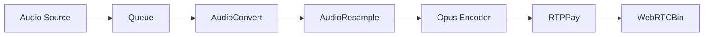
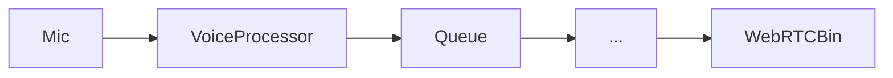

# Audio/Video Implementation Analysis & Echo Issue

**Date:** 28. Dezember 2025
**Status:** Analysis Complete / Implementation Pending
**Reference:** [Monal Issue #1523](https://github.com/monal-im/Monal/issues/1523)

## Executive Summary

The user reports significant echo issues when using DinoX to call Monal and Conversations clients. The Monal developer suggests the issue lies with the DinoX client.

**My analysis confirms this:** While DinoX has code for Acoustic Echo Cancellation (AEC) in `VoiceProcessor.vala`, **it is currently not wired into the active WebRTC pipeline**. The audio signal from the microphone is sent directly to the network without any processing, causing the remote party (Monal/Conversations) to hear themselves.

## Current Architecture

DinoX uses a modern GStreamer `webrtcbin` based pipeline in `plugins/rtp/src/webrtc_call_manager.vala`.

### 1. Audio Input Pipeline (Current)

*   **Problem:** The raw audio from the microphone goes straight to the encoder. There is no filter to remove the audio being played back by the speakers.

### 2. Audio Output Pipeline (Current)

*   **Problem:** The audio going to the speakers is not being "tapped" or monitored. The AEC algorithm needs to know *exactly* what is being played out to subtract it from the microphone input.

## The "Hidden" AEC Code

I found a complete implementation of an AEC solution in `plugins/rtp/src/voice_processor.vala`:

*   **`EchoProbe`:** A GStreamer element designed to sit in the *output* pipeline. It records what is being played.
*   **`VoiceProcessor`:** A GStreamer element designed to sit in the *input* pipeline. It takes the data from `EchoProbe` and uses the WebRTC Audio Processing Library (APM) to remove the echo from the microphone signal.

**Crucial Finding:** Neither `EchoProbe` nor `VoiceProcessor` are instantiated or added to the pipeline in `webrtc_call_manager.vala`. They exist in the codebase but are effectively "dead code" in the current WebRTC implementation.

## Why Previous AI Attempts Likely Failed

Integrating AEC into GStreamer pipelines is notoriously difficult for several reasons:

1.  **Clock Skew & Latency:** The `EchoProbe` (output) and `VoiceProcessor` (input) must be perfectly synchronized. If the "reference signal" arrives too late or too early, the AEC fails or makes the audio worse.
2.  **Pipeline State:** GStreamer elements must be linked and unlinked dynamically. Doing this while the pipeline is running (e.g., when a call starts) often leads to deadlocks or state errors if not done precisely.
3.  **Drift:** Different audio devices (mic vs speaker) often run on slightly different hardware clocks. The `VoiceProcessor` code I found attempts to handle this (`adjust_to_running_time`), but it's complex.

## Proposed Solution

We need to surgically modify `plugins/rtp/src/webrtc_call_manager.vala` to insert these elements.

### New Input Pipeline

### New Output Pipeline

### Implementation Plan

1.  **Instantiate `EchoProbe`** when the call starts.
2.  **Instantiate `VoiceProcessor`** and pass it the `EchoProbe` reference.
3.  **Insert `VoiceProcessor`** into the `add_audio_track()` method chain immediately after the source.
4.  **Insert `EchoProbe`** into the `on_decoded_pad()` method chain immediately before the sink.
5.  **Handle Cleanup:** Ensure both are destroyed properly when the call ends to avoid memory leaks or keeping audio devices open.

## Conclusion

The Monal developer is correct. The echo is caused by DinoX sending raw microphone input. Fixing this requires wiring up the existing (but unused) AEC components.
